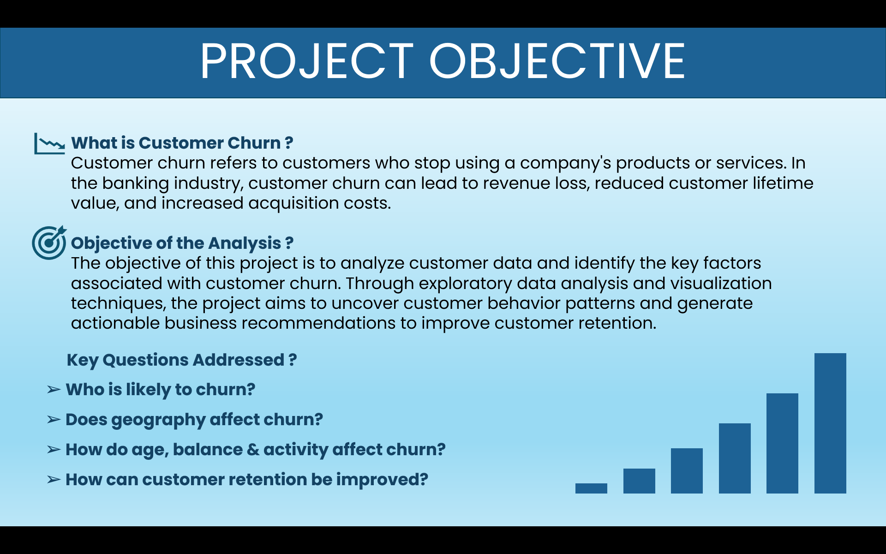
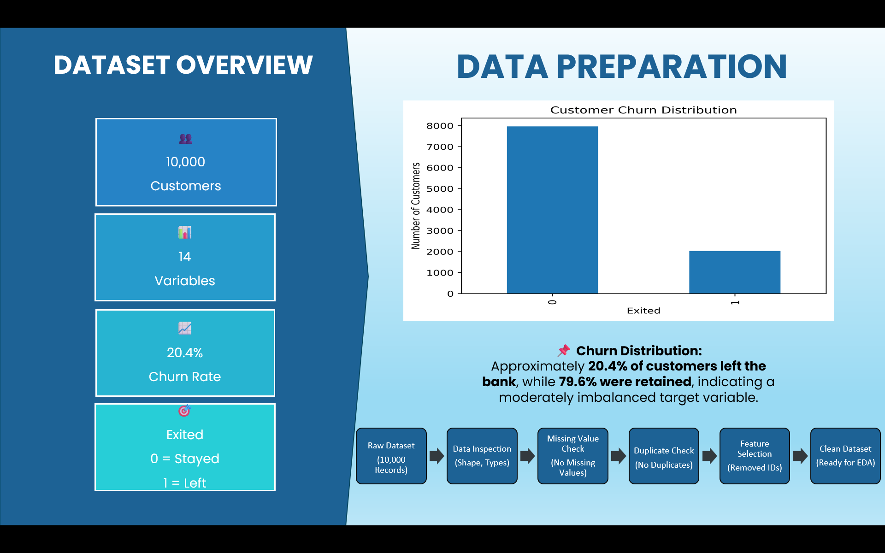
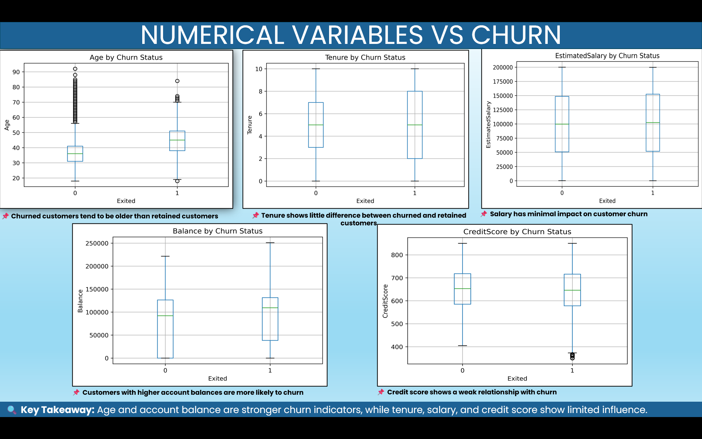
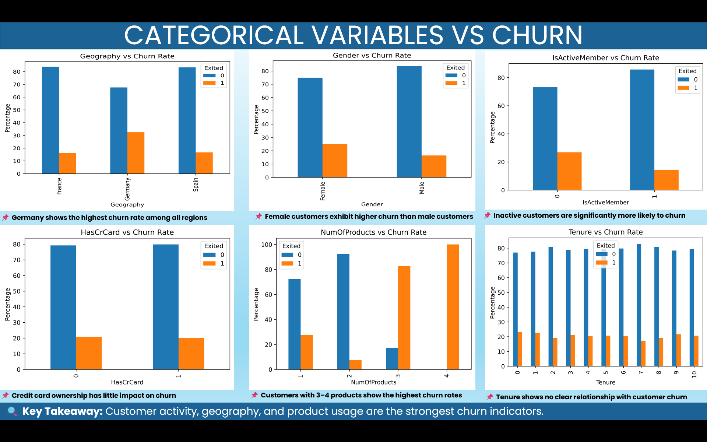
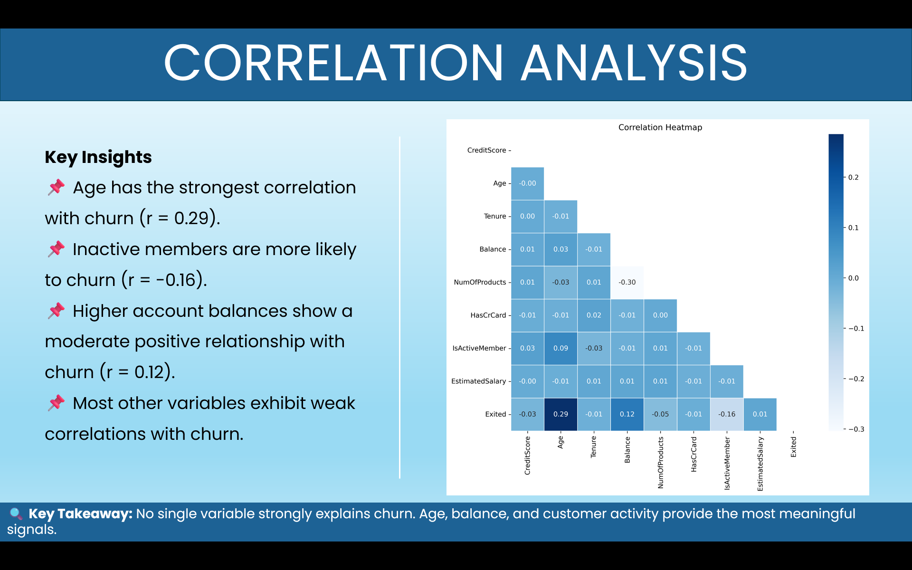
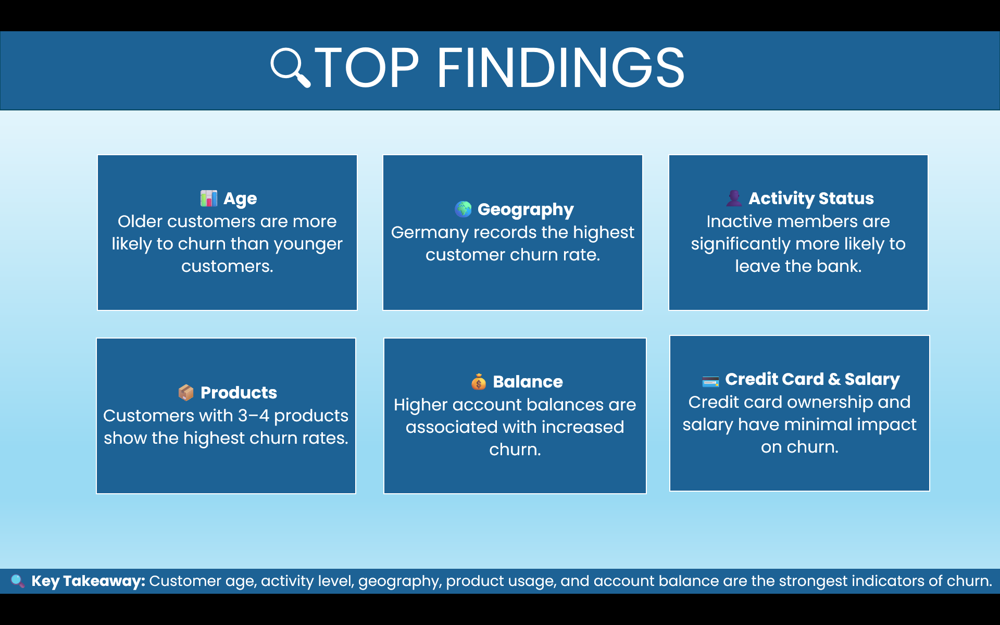
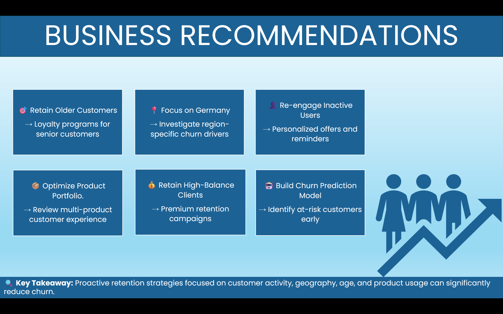

  

# Python Bank Customer Churn Analysis
Customer churn analysis project developed in Python using exploratory data analysis (EDA), data visualization, and statistical techniques to identify the key factors influencing customer churn and provide actionable business recommendations.

---

## Project Overview

Customer retention is one of the most important challenges for businesses. This project analyzes customer demographic, financial, and behavioral data to understand why customers leave the bank and identify the factors associated with customer churn.

The analysis includes data cleaning, exploratory data analysis, visualization, and interpretation of business insights using Python.

Understand customer churn behavior.
- Clean and preprocess the dataset.
- Explore numerical and categorical variables.
- Identify relationships between customer characteristics and churn.
- Generate business insights through visualization.
- Provide recommendations to improve customer retention.

---

## Dataset

- **Dataset:** Bank Customer Churn Dataset
- **Records:** 10,000 customers
- **Features:** Customer demographics, account information, banking behavior, and churn status.

---

## Tools & Libraries

- Python
- Pandas
- NumPy
- Matplotlib

---

## Project Workflow

1. Data Import
2. Data Cleaning
3. Exploratory Data Analysis (EDA)
4. Numerical Variable Analysis
5. Categorical Variable Analysis
6. Correlation Analysis
7. Business Insights
8. Business Recommendations

---

## Project Files

### `churn_analysis.py`

Contains the complete Python implementation including:

- Data loading
- Data preprocessing
- Exploratory Data Analysis
- Data visualization
- Statistical analysis

### `Churn_Modelling.xlsx`

Original customer churn dataset used for the analysis.

---

## Analysis Preview

### Project Objective

---

### Dataset Overview

---

### Numerical Variable Analysis

---

### Categorical Variable Analysis

---

### Correlation Analysis

---

### Key Findings

---

### Business Recommendations

---

## Key Insights

- Customer churn increases with customer age.
- Active members are less likely to leave the bank.
- Geography has a noticeable impact on churn.
- Customers with higher account balances tend to churn more frequently.
- Credit score alone has a relatively weak relationship with churn.

---

## Future Improvements

- Build predictive machine learning models.
- Compare different classification algorithms.
- Develop an interactive dashboard.
- Deploy the project as a web application.

---

## Author

**Meghna Singh**

M.Sc. Statistics | Aspiring Data Analyst

GitHub: https://github.com/meghna061

LinkedIn: https://www.linkedin.com/in/meghna-singh-033641201
